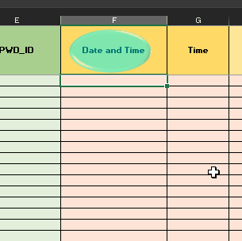

# Motivation
It is tiring to input the date and time manually over and over again. For those who work in healthcare
who have to fill up huge forms or tables, it will give you less headache if you could at least type in the date and time. Without the hassle of pressing the shift button just to type in the colons, then you have to edit some of it in the formula bar, check up the time then—what day is it? So yeah... this is how
you'll take some burden off your shoulders.

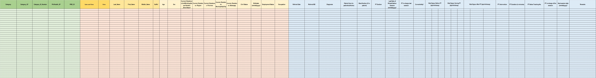

## Patient Form Example
Someone I know who's currently studying in medicine sent an example of their forms that have to be filled up. Imagine that they have been filling this up manually. She said they were only taught up to the basic use of excel(she made this form). Considering that they will be using Excel for most part of their job, it is indeed unfortunate that they could only know the basic use of it.

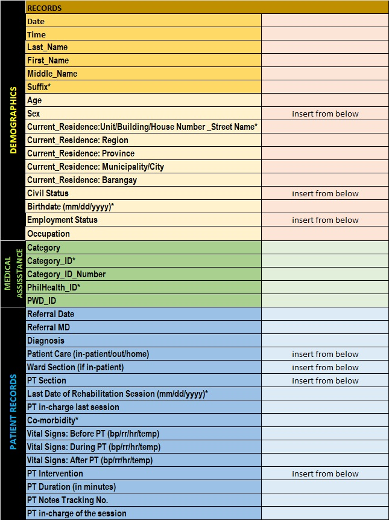

# Tutorial
With this tutorial—however not much, since only two cells will be filled automatically—it will teach you how to automate and become at least familiar with basic programming. May you find the joy and open doors for you in programming, because the world is evolving towards computer technology.

## Create a shape oject
You can create a shape by going to the _Insert_ tab. Under the _Illustrations_, select _Shapes_ then pick your favorite shape. I chose _Oval_ for this example. You may edit or format the shape. I will not affect the program you're about to make. 

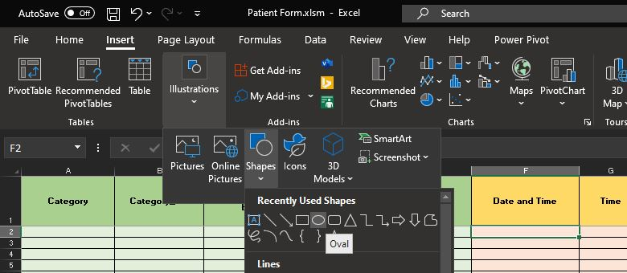

## Right-click the shape object and Assign Macro
After you have made your shape object—you might as well have edited or formatted it for a while and that's okay—right-click it and select _Assign Macro_.

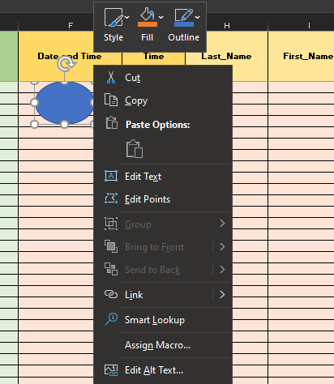

## Click New
Excel will give your shape a default name of `Oval1_Click`. That means, you will have to refer the shape you created in your program as `Oval1_Click`. Select _New_. It will open up a new window where you will put your code.

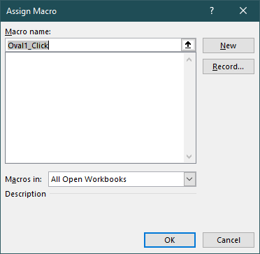

## Macro Editor
As you can see below, it says, "`Sub Oval1_Click()`." I know you are asking these questions as you read:
- "What does it mean?"
- "Is `Oval1_Click()` different from `Oval1_Click`?"
- "What is `Sub` and `End Sub`?"

I will explain all of that later. If you're already familiar with programming, you may skip this part and check it out [here](#the-code-discussion). It will take you to the bottom part of the page.

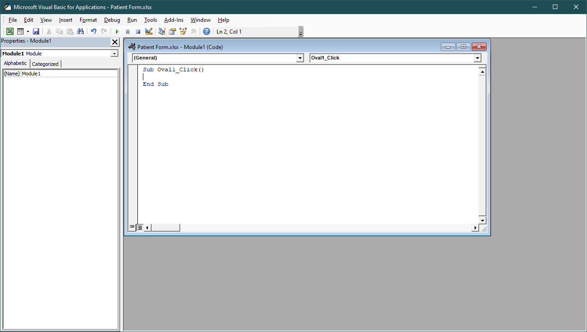

## Rename the Object
This is optional, but to make life easier, let us rename our object akin to its function. This will make the code readable and your overall work much more easy to understand; not only by you, but also by others.

### Go to the Selection Pane
Go to _Home_ tab. On the far right side, there should be a _Find & Select_ menu. If you click on it, it will show you the the following figure below. If you can't find it in your _Home_ tab, then maybe your Excel setting is different, but that's another topic. You can always use the search bar on the top center of your excel window and from there, it the _Selection Pane_ would just pop up on the right.

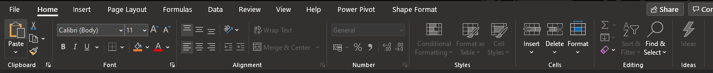

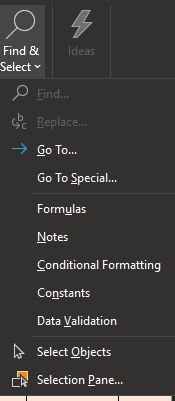
*Selection Pane*

Click on the _Selection Pane_ and it will open a side bar on the right side.
### Rename the shape
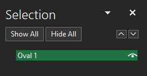

### Change the name of the object back in the macro editor
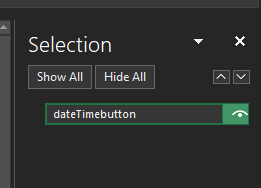

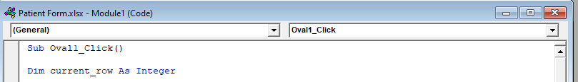

## Save as .xlsm
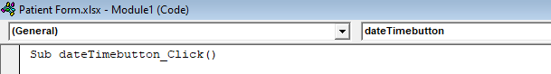

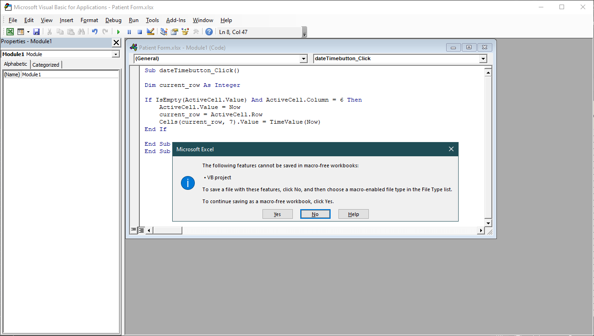

## Go back to the button and assign the name you chose as the macro
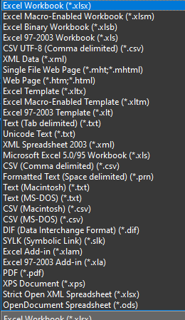

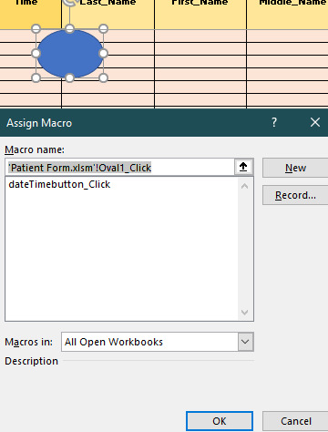

# The Code Discussion

```vb
Private Sub Form_Load()
    ' Execute a simple message box that says "Hello, World!"
    MsgBox "Hello, World!"
End Sub


Sub Oval1_Click()
Dim current_row As Integer

If IsEmpty(ActiveCell.Value) And ActiveCell.Column = 6 Then

Else 
    current_row = ActiveCell.Row + 1
End If
    ActiveCell.Value = Now
    Cells(current_row, 7).Value = TimeValue(Now)
End Sub


Sub dateTimebutton_Click()

Set myDocument = Worksheets(1)
myDocument.Shapes("dateTimebutton").Fill.ForeColor.RGB = RGB(255, 0, 0)

Application.OnTime Now + TimeValue("00:00:01"), "proc"

Dim current_row As Integer

If IsEmpty(ActiveCell.Value) And ActiveCell.Column = 6 Then
    current_row = ActiveCell.Row
Else
    current_row = ActiveCell.Row
End If
    ActiveCell.Value = Now
    Cells(current_row, 7).Value = TimeValue(Now)
   
End Sub

Private Sub LastUsedRow()

    Dim last_row As Integer

    last_row = Cells(Rows.Count, 1).End(xlUp).Row


    Debug.Print last_row
End Sub

Private Sub proc()
Set myDocument = Worksheets(1)
myDocument.Shapes("dateTimebutton").Fill.ForeColor.RGB = RGB(0, 255, 255)
End Sub


```

Google app scripts

```js
function setValue(cellName, value) {
  SpreadsheetApp.getActiveSpreadsheet().getRange(cellName).setValue(value);
}

function getValue(cellName) {
  return SpreadsheetApp.getActiveSpreadsheet().getRange(cellName).getValue();
}

function getNextRow() {
  return SpreadsheetApp.getActiveSpreadsheet().getLastRow() + 1;
}

function setUser1() {
  setValue('E3', new Date());
}

function addRecord(a, b, c) {
  var row = getNextRow();
  setValue('A' + row, a);
  setValue('B' + row, b);
  setValue('C' + row, c);
}

function punchIn() {
  addRecord(getValue('E3'), new Date(), 'In - Work from Home');
}


function punchOut() {
  addRecord(getValue('E3'), new Date(), 'Out - Work from Home');
}

function punchInOS() {
  addRecord(getValue('E3'), new Date(), 'In - Office');
}

function punchOutOS() {
  addRecord(getValue('E3'), new Date(), 'OUT - Office');
}

```

[Yoyoyoyo][1]

[1]: https://docs.microsoft.com/en-us/office/vba/excel/concepts/cells-and-ranges/make-a-cell-blink

### References
- [Shape object](https://docs.microsoft.com/en-us/office/vba/api/excel.shape)
- [Fill](https://docs.microsoft.com/en-us/office/vba/api/excel.shape.fill)
- [VBA Model Click() Event](https://docs.microsoft.com/en-us/office/vba/language/reference/visual-basic-add-in-model/events-visual-basic-add-in-model)
- [VBA Model Application.OnTIme() Method](https://docs.microsoft.com/en-us/office/vba/api/excel.application.ontime)

