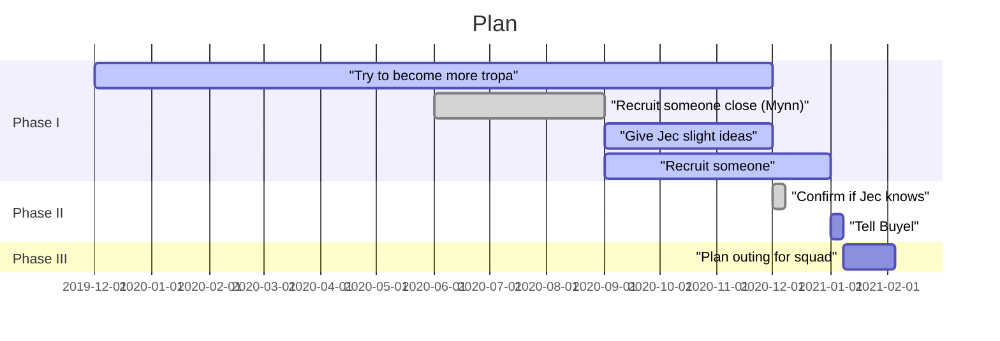

```mermaid
gantt
    title Plan
    dateFormat  MM-YYYY
    section Phase I
    "Try to become more tropa": active, a1, 12-2019, 12-2020
    "Recruit someone close (Mynn)": done, a2, 06-2020, 09-2020
    "Give Jec slight ideas": active, a3, after a2, 12-2020
    "Recruit someone": active, a4, after a2, 01-2021

    section Phase II
    "Confirm if Jec knows": done, b1, after a3, 1w
    "Tell Buyel": b2,after a4, 1w

    section Phase III
    "Plan outing for squad": c1, after b2, 4w
```
